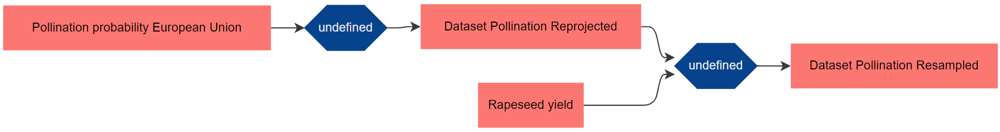
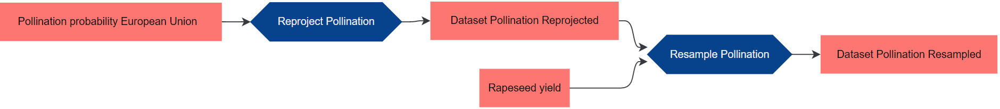
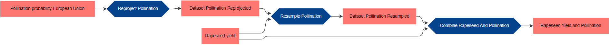

# Introduction to `ckanr` and the GeoKur Metadata scheme on the example of provenance tracing

Provenance can be traced by filling the according metadata fields in the GeoKur CKAN metadata catalog. By using the R-package `ckanr`, which is a wrapper around the CKAN-API, datasets of a CKAN-Catalog can be accessed, created, uploaded and deleted from the the R environment.

By updating or creating metadatasets at script execution, provenance information for each dataset that was used in the script can be traced. Full provenance graphs of connected datasets are ultimately generated by the GeoKur CKAN internals and pushed into an RDF-triplestore (from which the provenance can be queried and visualized).

For showcasing this tracing system, we download a raster dataset and its metadata from the GeoKur CKAN, reproject the raster and upload its (provenance) metadata to the GeoKur CKAN. We then resample the reprojected raster and also upload the new metadataset to CKAN. Finally, we combine the raster with an other raster in a common table.

Before downloading the input data, we get used to `ckanr`s methods and browse the GeoKur CKAN. General information on CKAN API (e.g. How to get an API-Token?), can be found in the official API Documentation [https://docs.ckan.org/en/2.9/api/]. The full `ckanr` documentation is available at https://cran.r-project.org/web/packages/ckanr/ckanr.pdf.

The document is wrapped up with some further examples for updating and deleting metadata as well as uploading the actual data. Furthermore, at the bottom of the document you find a reference of the metadata fields that are used in the GeoKur CKAN.

### Setup

```R
# Load required packages
if (!require("ckanr")) install.packages("ckanr");library ("ckanr")
if (!require("raster")) install.packages("raster");library ("raster")
if (!require("rgdal")) install.packages("rgdal");library ("rgdal")

# Configure CKAN connection
ckanr_setup("https://geokur-dmp.geo.tu-dresden.de/", key = "***")

# Set some useful variables for later
dataset_base_url <- "https://geokur-dmp.geo.tu-dresden.de/dataset/"
process_base_url <- "https://geokur-dmp.geo.tu-dresden.de/process/"
workflow_base_url <- "https://geokur-dmp.geo.tu-dresden.de/workflow/"
```

### Browse CKAN

These are some general examples of the ckanr/API usage. In CKAN, a metadataset is called a `package`. A package can have multiple actual data files attached to it; those are referred to as `resources`. _Metadata <-> Package; Data <-> Resource_.

```R
# browse ckan available datasets, package list gives the human-readable identifieres of every public dataset. The API refers to those human-readable identifieres as "name". In the CKAN Webpage we call them "Identifier" (see reference at the bottom).
ckan_available_datasets <- package_list()

# access the metadata of a given dataset by its "name"
# package_show returns an R List object
pollination_metadata <- package_show("demand-and-supply-of-pollination-in-the-european-union-test") 

# view specific metadata fields
pollination_metadata$id
pollination_metadata$name

# view all fields and attached resources
str(pollination_metadata)

# ignore resource list in view
str(pollination_metadata, max.level=1)

# view attached resources
str(pollination_metadata$resource)

# view name, download url and id of each attached resource (only 1 resource in this case)
for (resource in pollination_metadata$resource){
    str(resource$name)
    str(resource$url)
    str(resource$id)
}

# get resource download url (target resource is nb. 1 in resource list)
target_index <- 1
download_url_pollination <- pollination_metadata$resource[[target_index]]$url

# you can also access the resources url directly by using an api request
download_url_pollination_ <- resource_show(id = "eeecaa00-4da4-4022-9ae6-8a7849e9d5c1")$url
```

Of course, the URL can also be found by carefully looking into the metadata (of the resource) of the pollination dataset at the CKAN website [https://geokur-dmp.geo.tu-dresden.de/dataset/demand-and-supply-of-pollination-in-the-european-union-test/resource/eeecaa00-4da4-4022-9ae6-8a7849e9d5c1].

### Download Resource and Reproject It

The actual download of the data is happens by passing the download URL of the resource to the function `raster()` from the R-package `raster`.

```R
# Download raster from CKAN and parse it to an R Object called pollination
pollination <- raster(download_url_pollination)

# reproject the raster to WGS84
pollination_reprojected <- projectRaster(pollination, crs="+proj=longlat +datum=WGS84 +no_defs")
```

## Create New CKAN Metadata DS

The GeoKur CKAN has 3 mandatory metadata fields `name`, `owner_org`, `contact_name`. A list of registered organizations at a CKAN instance can be viewed with the `ckanr` method `organization_list()`.

Besides this mandatory fields, we happen to know the new CRS of the dataset and enter it in the according field (`conforms_to`). We furthermore want to give the dataset a `title`, which is the displayed name of the dataset. Lastly we fill a metadata filed called `type`; this field specifies the metadata scheme that is used. In GeoKur, we differentiate between dataset-metadata, process-metadata and workflow-metadata. The `type` field defaults to `"dataset"`, so we wouldn't really need to fill it in this case.

At the bottom of this document you find reference tables for all metadata fields and their IDs. The full GeoKur Metadata Scheme can be reviewed at https://zenodo.org/record/4916698.

__Proveance information is traced by filling the `was_derived_from` field.__

The `was_derived_from` field expects a string with either a comma separated list of links or a single link. To construct the link of the input dataset, we concatenate the CKAN base URL for datasets with the input datasets id.

```R
# create new Metadata DS in CKAN and store it in an R object (dataset_pollination_proj).

# !! owner_org and contact_name are mandatory; fill with your name and your organizations 
# name//id. Get all registered organizations and their names//ids with organization_list()
pollination_reprojected_metadata <- package_create(
  extras = c(
    type = "dataset",
    name = "dataset_pollination_reprojected",
    title = "Dataset Pollination Reprojected",
    conforms_to = "http://www.opengis.net/def/crs/OGC/1.3/CRS84",
    owner_org = "...",
    contact_name = "...",
    was_derived_from = paste0(
      dataset_base_url, pollination_metadata$id
    )
  )
)
```

If a dataset is derived by multiple other datasets, correct concatenation is achieved as follows:

```R
was_derived_from = paste(
  paste0(dataset_base_url, metadata1$id), 
  paste0(dataset_base_url, metadata2$id), 
  sep=","
)
```

### Resample File and Trace Provenance

Now we download an other file and resample the reprojected pollination file to the resolution of the other file.

```R
yield_rapeseed_metadata <- package_show("rapeseed-yield")
yield_rapeseed <- raster(yield_rapeseed_metadata$resource[[1]]$url)

pollination_resampled <- resample(pollination_reprojected,yield_rapeseed) 
pollination_resampled_metadata <- package_create(
  extras = c(
    type = "dataset",
    name = "dataset_pollination_resampled",
    title = "Dataset Pollination Resampled",
    conforms_to = "http://www.opengis.net/def/crs/OGC/1.3/CRS84",
    owner_org = "...",
    contact_name = "...",
    was_derived_from = paste(
      paste0(dataset_base_url, pollination_reprojected_metadata$id), 
      paste0(dataset_base_url, yield_rapeseed_metadata$id), 
      sep=","
    )
  )
)
```

By now, the constructed provenance graph looks as follows:



Datasets are shown in red. The processes that drove the derivation of the datasets are shown in blue (We didn't specify any process, hence they are undefined).

## Adding Processes to the Provenance Graph

Provenance can not only describe a trail of datasets that were derived from each other, but also the processes (or models, or ...) that made use of these datasets, to generate new ones. The GeoKur CKAN provides means to store process metadata and therefore provenance information of processes that were used within the data derivation trail.

We use the GeoKur process metadata scheme to define the processes that are currently present in the graph and add one last process at the end.

### Reproject and Resample

The inputs of a process are defined by filling the `used` field, the outputs by filling the `generated` field. Both fields are similar to `was_derived_from` in terms of syntactical requirements. Furthermore, for each process, one or more process categories can be defined. For the definitions see https://geokur-dmp.geo.tu-dresden.de/category-register (not online yet). __Use `type = "process"` to appliy the process metadata scheme.__

```R

reproject_metadata <- package_create(
  extras = c(
    type = "process",
    name = "reproject_pollination",
    title = "Reproject Pollination",
    owner_org = "...",
    contact_name = "...",
    used = paste0(dataset_base_url, pollination_metadata$id),
    generated = paste0(dataset_base_url, pollination_reprojected_metadata$id),
    category = "geokur:Transformation"
  )
)


resample_metadata <- package_create(
  extras = c(
    type = "process",
    name = "resample_pollination",
    title = "Resample Pollination",
    owner_org = "...",
    contact_name = "...",
    used = paste(
      paste0(dataset_base_url, yield_rapeseed_metadata$id),
      paste0(dataset_base_url, pollination_reprojected_metadata$id),
      sep=","),
    generated = paste0(dataset_base_url, pollination_resampled_metadata$id),
    category = "geokur:Transformation"
  )
)
```


### A final process

If a process with filled `used` (inputs) and `generated` (outputs) fields was added to the catalog, the according `was_derived_from` field in the output datasets is redundant and can be left blank. We add one last process that generates a final dataset to showcase that behavior.

```R

# combine pollination and yield data  to table
output_table <- cbind(as.data.frame(yield_rapeseed),as.data.frame(pollination_resampled)) 
names(output_table) <- c("yieldRapeseed","pollination")
# remove 0 yields and NAs
output_table_final <- output_table[which(output_table$yield_rapeseed>0&!is.na(output_table$pollination)),] 

final_dataset_metadata <- package_create(
  extras = c(
    name = "rapeseed_yield_and_pollination",
    title = "Rapeseed Yield and Pollination",
    conforms_to = "http://www.opengis.net/def/crs/OGC/1.3/CRS84",
    notes = "Combined rapeseed yield and pollination as CSV",
    owner_org = "...",
    contact_name = "..."
))

cbind_metadata <- package_create(
  extras = c(
    type = "process",
    name = "combine_rapeseed_and_pollination",
    title = "Combine Rapeseed And Pollination",
    notes = "Bind rapeseed yield and pollination rasters to common table and remove rapeseed values equal to zero and pollination values that are not defined.",
    owner_org = "...",
    contact_name = "...",
    used = paste(
      paste0(dataset_base_url, yield_rapeseed_metadata$id),
      paste0(dataset_base_url, pollination_resampled_metadata$id),
      sep=","),
    generated = paste0(dataset_base_url, final_dataset_metadata$id),
    category = "geokur:Selection"
  )
)
```

Notice that we didn't use the `was_derived_from` field.
The provenance graph after these uploads looks as follows:



## Mark Finished Workflows

The GeoKur metadata scheme for workflows provides means to assign datasets and process to a common workflow. A workflow can be marked as finished by providing one or more resulting datasets. Ultimately, GeoKur workflows can be used to group parts of large provenance graphs into logical units. We consider all processing steps that were executed in this script a workflow and set up the according metadata.

```R
workflow_metadata <- package_create(
  extras = c(
    type = "workflow",
    name = "combine_rasters",
    title = "Combine Rasters",
    notes = "Combine rasters with different projections and resolutions in a common table",
    owner_org = "...",
    contact_name = "...",
    rel_datasets = paste(
      paste0(dataset_base_url, yield_rapeseed_metadata$id),
      paste0(dataset_base_url, pollination_metadata$id),
      paste0(dataset_base_url, pollination_resampled_metadata$id),
      paste0(dataset_base_url, pollination_reprojected_metadata$id),
      sep=","),
    rel_processes = paste(
      paste0(process_base_url, reproject_metadata$id),
      paste0(process_base_url, resample_metadata$id),
      paste0(process_base_url, cbind_metadata$id),
      sep=","),
    result = paste0(dataset_base_url, final_dataset_metadata$id)
  )
)
```

## Updating and Deleting Metadata/ Upload Data


### Update Metadata

We forgot to add the CRS to the metadata of the resampled pollination metadata and now want to rectify this blunder.

There are two ways of updating metadatasets with the CKAN API, `package_patch` and `package_update`. `package_patch` only updates the specified fields and leaves all filled fields as they are. `package_update` otherwise, deletes all content from the dataset and then fills in the specified fields.

`package_patch` in `ckanr` is currently not working. Therefore, we use `package_update` and have to pass all existing metadata plus the new fields to the method:

```R
# get current resample metadataset (if not in current R environment already; e.g. from package_create)
pollination_resampled_metadata <- package_show('dataset_pollination_resampled')

# add crs entry to list
pollination_resampled_metadata$conforms_to = "http://www.opengis.net/def/crs/OGC/1.3/CRS84"

# remove some CKAN default fields that are not in our scheme and cause errors
pollination_resampled_metadata[which(names(pollination_resampled_metadata)%in%c("author_email", "maintainer_email"))] <- NULL

# pass all metadata as list(->unclass) to package_update()
package_update(unclass(pollination_resampled_metadata), pollination_resampled_metadata$id)
```

### Upload Data

It can make sense to attach the files that were generated by the script, to the according metadata entries. Here, we want to do this for the final table.

Uploading data requires it to be stored a your hard drive, you cannot directly upload R objects.

```R
# get metadataset (if not in current R environment already; e.g. from package_create)
final_dataset_metadata <- package_show('rapeseed_yield_and_pollination')

# store our result locally
write.csv(output_table_final, "result.csv")

# upload resource
resource_metadata <- resource_create(package_id = final_dataset_metadata$id,
                        name = "rapeseed_and_poll_resource",
                        upload = "./result.csv",
                        rcurl = "https://geokur-dmp.geo.tu-dresden.de/dataset"
 )

```

### Delete Metadata

Deleting Datasets is fairly simple:

```R
# get metadata 
pollination_reprojected_metadata <- package_show("dataset_pollination_reprojected")
pollination_resampled_metadata <- package_show("dataset_pollination_resampled")
final_dataset_metadata <- package_show("rapeseed_yield_and_pollination")
reproject_metadata <- package_show("reproject_pollination")
resample_metadata <- package_show("resample_pollination")
cbind_metadata <- package_show("combine_rapeseed_and_pollination")
workflow_metadata <- package_show("combine_rasters")


# destroy everything that was built
package_delete(pollination_reprojected_metadata$id)
package_delete(pollination_resampled_metadata$id)
package_delete(final_dataset_metadata$id)
package_delete(reproject_metadata$id)
package_delete(resample_metadata$id)
package_delete(cbind_metadata$id)
package_delete(workflow_metadata$id)
```

## Schema Reference

The following tables serve as reference to find the IDs that are used to access the metadata fields from the API. Expected Input describes in which form the the according field expects the input to be. Expected datatypes that are marked as _complex_ require stringified JSON, to infer the correct structure please review the JSON representation of an existing dataset (e.g.: https://geokur-dmp.geo.tu-dresden.de/dataset/potyield) or create an according test dataset.

### Dataset Scheme

<!-- <style>
table th:first-of-type {
    width: 15%;
}
table th:nth-of-type(2) {
    width: 15%;
}
table th:nth-of-type(3) {
    width: 30%;
}
table th:nth-of-type(4) {
    width: 40%;
}
</style> -->
| Key | Title | Expected Input | Help Text
|:--------- |:---------| :----------|:--------|
|title|Title|String||
|name|Identifier|String||
|notes|Description|String||
|documentation|Documentation|String containing a valid URL|eg. link to publication|
|contact_name|Contact Point|String||
|contact_uri|Contact Point - ORCID|String containing a valid URL|According ORCID as link, leave blank otherwise|
|alternate_identifier|Dataset DOI|String containing a valid URL|e.g. https://doi.org/10.7283/T5MW2F2D|
|url|Information Website|String containing a valid URL|links to project website or dataset's page|
|tag_string|Keywords|_complex_||
|theme|Theme / Category|String containing one or more valid URLs that are comma separated.|Provide links to descriptions of the themes; separate by comma. E.g.: http://inspire.ec.europa.eu/theme/ad, http://inspire.ec.europa.eu/theme/au.|
|spatial|Spatial Coverage|_complex_|Draw and edit the dataset extent as rectangles on the map, or paste a GeoJSON Polygon or Multipolygon geometry below, or create a bounding box from coordinates|
|conforms_to|Coordinate Reference System|String containing a valid URL|Provide link to OGC definition of the CRS, http://docs.opengeospatial.org/DRAFTS/18-058.html#_crs_identifier_list, e.g. http://www.opengis.net/def/crs/EPSG/0/4326|
|spatial_resolution|Spatial Resolution|Value as String|Spatial Resolution (the unit is determined by the resolution type)|
|spatial_resolution_type|Spatial Resolution Measured|String; one of _"angular"_, _"scale"_ or _"meters"_|In meters: This property refers to the minimum spatial separation resolvable in a Dataset, measured in metres. As angular scale: Spatial resolution expressed as equivalent scale [ISO-19115], [ISO-19115-1], by using a representative fraction (e.g., 1:1,000, 1:1,000,000). As angular distance: Spatial resolution expressed as angular distance [ISO-19115-1], by using a decimal degree. As vertical distance: Spatial resolution expressed as vertical distance [ISO-19115-1].|
|temporal_start|Temporal Coverage Start|String; date formatted as "YYYY-MM-DD"||
|temporal_end|Temporal Coverage End|String; date formatted as "YYYY-MM-DD"||
|temporal_resolution|Temporal Resolution|String|E.g. 'P2Y3M20D' describes a period 2 years, 3 months and 20 days or 'P1D' describes a period of 1 day|
|quality_metrics|Data Quality Metric|_complex_|Value of quality metric: Measured Value of the selected quality metric \| Ground Truth Dataset: Link to ground truth dataset \| Confidence term: Label of the confidence value of the selected quality metric, e.g. r value \| Confidence value: According confidence threshold \| Thematic representativity: Describes thematic aspects for which quality information is given \| Spatial representativity: Describes region for which quality information is given \| Temporal representativity: Describes time step or range for which quality information is given \| Name of quality source: Name of the source of information of the selected quality metric \| Type of quality source: Describes the origin of the quality information: data, report, scientific publication, Web site, other \| Link to quality source: Web link to access the quality information source|
|is_version_of|Is Version of|String containing one or more valid URLs that are comma separated. The URLs should point to a dataset|A related resource of which the described resource is a version, edition, or adaptation. Changes in version imply substantive changes in content rather than differences in format.|
|is_part_of|Is Part of|String containing one or more valid URLs that are comma separated. The URLs should point to a dataset|A related resource in which the described resource is physically or logically included (https://dublincore.org/specifications/dublin-core/dcmi-terms/#isPartOf).|
|was_derived_from|Was derived from|String containing one or more valid URLs that are comma separated. The URLs should point to a dataset|Please specify datasets.|
|owner_org|Organization|String; has to match an existing organizations ID in the CKAN instance||
|license_id|Dataset License|String|Recommended best practice is to identify the license using a URI. Examples of such licenses can be found at http://creativecommons.org/licenses/.|

### Process Scheme

| Key | Title | Expected Input | Help Text
|:--------- |:---------| :----------|:--------|
|title|Title|String||
|name|Identifier|String||
|notes|Description|String|Describe the core characteristics.|
|documentation|Documentation|String containing a valid URL|Reference a documentation resp. related publication.|
|used|Used|String containing one or more valid URLs that are comma separated. The URLs should point to a dataset|Please specify input datasets.|
|generated|Generated|String containing one or more valid URLs that are comma separated. The URLs should point to a dataset|Please specify output datasets.|
|category|Category|List of Strings; Strings have to match preset values|Please categorize the process|
|owner_org|Organization|String; has to match an existing organizations ID in the CKAN instance||

### Workflow Scheme

| Key | Title | Expected Input | Help Text
|:--------- |:---------| :----------|:--------|
|title|Title|String||
|name|Identifier|String||
|notes|Description|String|Describe the core characteristics.|
|documentation|Documentation|String containing a valid URL|Reference a documentation resp. related publication.|
|source_code|Source code|String containing a valid URL|Reference the related source code, e.g. link to GitHub or Zenodo folder.|
|rel_datasets|Related datasets|String containing one or more valid URLs that are comma separated. The URLs should point to a dataset|Please specify related datasets.|
|result|Result|String containing one or more valid URLs that are comma separated. The URLs should point to a dataset|Please specify output datasets.|
|rel_processes|Related processes|String containing one or more valid URLs that are comma separated. The URLs should point to a dataset|Please select all processes that are included in the worklow.|
|owner_org|Organization|String; has to match an existing organizations ID in the CKAN instance||